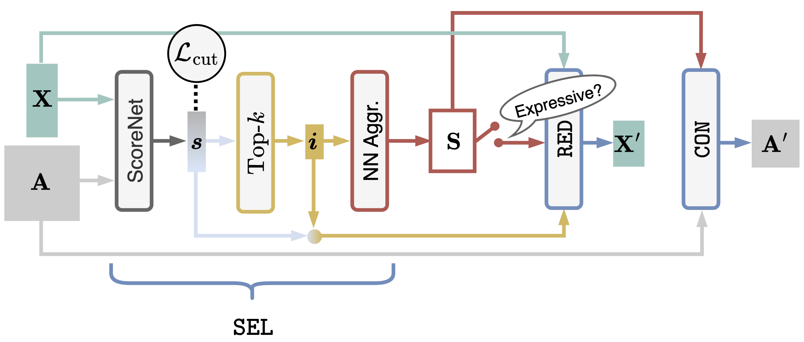

# MaxCutPool

[](https://arxiv.org/abs/2409.05100)
[](https://iclr.cc/Conferences/2025)
[](docs/)

Official implementation of the paper [*"MaxCutPool: differentiable feature-aware Maxcut for pooling in graph neural networks"*](https://arxiv.org/abs/2409.05100) by Carlo Abate and [Filippo Maria Bianchi](https://sites.google.com/view/filippombianchi/home).

## ⚡️ TL; DR

This repository contains the implementation of MaxCutPool, a novel approach to compute the MAXCUT in attributed graphs. The method is designed to work with graphs that have features associated with both nodes and edges. 




Key features:

- Fully differentiable architecture
- Robust to underlying graph topology
- Optimizes MAXCUT jointly with other objectives
- Implements a hierarchical graph pooling layer for GNNs
- Particularly effective for heterophilic graphs

## 🛠️ Installation

To install the required packages, create a conda environment using the provided environment file:

```bash
conda env create -f environment.yml
conda activate maxcutpool
```

The main dependencies include:
- Python 3.10
- PyTorch >= 2.0.0
- PyTorch Geometric (PyG)
- PyTorch Lightning
- Hydra
- Tensorboard (for logging)
- Various scientific computing libraries (numpy, scipy, etc.)

For a complete list of dependencies, see `environment.yml`.

## 🚀 Quick Start

For a basic example of how to use the MaxCutPool layer, check out `example.py`. This file demonstrates:
- Basic setup of the layer
- Integration with PyTorch Geometric
- Training and evaluation on a sample dataset

## 🧪 Experiments

To replicate the experiments from the paper, you can use the following run scripts:

1. MAXCUT evaluation experiments:

```bash
python run_maxcut.py # the GNN with MaxCutPool
python run_maxcut_baseline.py # used for comparison
```


2. Graph classification experiments:

```bash
python run_graph_classification.py
```

3. Node classification experiments:

```bash
python run_node_classification.py
```

> [!NOTE]
> Each script uses [Hydra](https://hydra.cc/) for configuration management. The corresponding YAML config files can be found in the `config` directory. 

> [!TIP] 
> You can override any configuration parameter from the command line, for example:

```bash
python run_graph_classification.py dataset=expwl1 pooler=edgepool
```

## 📂 Project Structure

This repository is structured as follows:

```
./
├── config/                     # Run configuration files
├── source/                     # Main package directory
│   ├── data/                   # Dataset handling
│   ├── layers/                 # Neural network layers
│   │   ├── maxcutpool/         # MaxCutPool layer implemenetation
│   │   ├── edgepool/           # EdgePool layer implementation
│   │   ├── kmis/               # KMIS layer implementation
│   │   └── ndp.py              # NDP layer implementation
│   ├── models/                 # Architectures for the different downstream tasks
│   ├── pl_modules/             # PyTorch Lightning modules for each downnstream task
│   └── utils/                  # Utility functions
├── example.py                  # Quick start example
├── run_maxcut.py               # MAXCUT experiment runner
├── run_maxcut_baseline.py      # MAXCUT baselines used for comparison
├── run_classification.py       # Classification experiment runner
├── run_node_classification.py  # Node classification runner
├── environment.yml             # Conda environment specification
├── README.md                   # This README file
├── requirements.txt            # PyG dependencies
└── LICENSE                     # MIT License
```

## 📚 Bibtex reference

If you find this code useful please consider citing our paper:

```bibtex
@inproceedings{abate2025maxcutpool,
  title={MaxCutPool: differentiable feature-aware Maxcut for pooling in graph neural networks},
  author={Abate, Carlo and Bianchi, Filippo Maria},
  booktitle={The Thirteenth International Conference on Learning Representations},
  year={2025},
  url={https://openreview.net/forum?id=xlbXRJ2XCP}
}
```